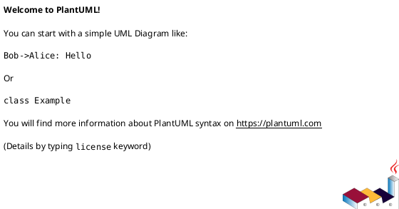
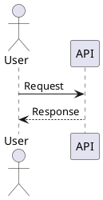
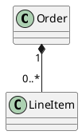
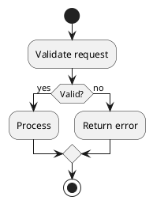

# PlantUML Expert

Use this skill to help with the full PlantUML workflow: choose the right diagram type, write valid PlantUML, validate syntax, render images, and replace markdown diagrams with image links when the output needs to be published.

## When To Use

Use this skill when the user wants any of the following:

- A PlantUML diagram from a plain-English description
- Source code turned into an architecture or UML diagram
- A `.puml` file rendered to `png` or `svg`
- Markdown `puml` blocks or linked `.puml` files converted to images
- PlantUML syntax checked or fixed
- Markdown prepared for Confluence, Notion, or other tools that cannot render PlantUML directly

## Core Behavior

1. Identify the user's real goal before writing syntax.
2. Pick the simplest diagram type that answers that goal.
3. Produce valid PlantUML first; styling is secondary.
4. When files are involved, preserve the `.puml` source and generate images alongside it.
5. When markdown is meant for publication, convert PlantUML to images before upload.

## Diagram Selection

Map intent to diagram type:

- Interactions over time: sequence
- Domain model or code structure: class
- Workflow or decision logic: activity
- Lifecycle or transitions: state
- Service or module architecture: component
- Infrastructure or runtime topology: deployment
- Actors and features: use case
- Database schema: ER
- Timeline or schedule: Gantt
- Idea hierarchy: mindmap or WBS
- JSON or YAML structure: `@startjson` or `@startyaml`
- UI sketch: SALT / wireframe

If the request is ambiguous, ask one short question or provide the most likely diagram with a brief note.

## Authoring Workflow

1. Extract the main entities, actors, states, or steps.
2. Choose diagram type.
3. Write a minimal valid diagram.
4. Add labels, notes, grouping, and styling only if they improve clarity.
5. Validate or render if the user asked for files or verification.

Prefer small, readable diagrams over dense ones. If the system is large, split it into multiple diagrams.

## Output Rules

When creating a diagram in chat:

- Briefly state the chosen diagram type and why.
- Return a fenced `puml` block.
- If useful, add 1-3 short notes about assumptions or how to render it.

When editing or generating files:

- Save source as `.puml`
- Render to `png` by default, `svg` if the user asks or if the output is for docs
- Keep generated image paths explicit in the response

## Syntax Baseline

Use the correct delimiters:



Common patterns:







## Code-To-Diagram Guidance

When converting code to diagrams:

1. Infer the runtime pieces first: clients, services, databases, queues, external systems.
2. For architecture questions, default to component or deployment diagrams.
3. For business flows or API calls, prefer sequence diagrams.
4. For domain objects and inheritance, prefer class diagrams.
5. Mention assumptions where the code does not fully specify behavior.

For typical stacks:

- Spring Boot / FastAPI / Node.js backends: component, deployment, sequence
- Python ETL: activity, component, deployment
- React frontends: component, deployment, sequence for user flows

## Markdown Conversion Workflow

If markdown contains PlantUML and the result is meant for Confluence, Notion, or another renderer that will not execute PlantUML:

1. Find embedded ```puml blocks and linked `.puml` references.
2. Convert each diagram to an image.
3. Replace the markdown diagram with an image link.
4. Keep the original `.puml` source for later edits.

If repository scripts exist for this workflow, prefer them. Otherwise use PlantUML CLI directly.

## Validation And Rendering

First verify the environment if setup is uncertain:

```bash
python scripts/check_setup.py
```

If repo scripts exist, prefer them:

```bash
python scripts/convert_puml.py diagram.puml
python scripts/convert_puml.py diagram.puml --format svg
python scripts/process_markdown_puml.py article.md
python scripts/process_markdown_puml.py article.md --validate
```

Fallback to PlantUML CLI when needed:

```bash
java -jar ~/plantuml.jar diagram.puml
java -jar ~/plantuml.jar --svg --output-dir out/ diagram.puml
java -jar ~/plantuml.jar --check-syntax diagram.puml
```

## Troubleshooting

Diagnose in this order:

1. Is Java installed and working?
2. Is `plantuml.jar` available?
3. Does the diagram use the correct start/end tags?
4. Is the requested diagram type using the right syntax family?
5. Is Graphviz required for this diagram/layout?

Common fixes:

- `plantuml.jar not found`: install it or use the configured path
- `java not found`: install JRE/JDK 8+
- Syntax error: reduce the diagram to a minimal valid example, then add pieces back
- Layout/rendering issue: simplify relationships, labels, or groups before adding styling

## Style Guidance

Optimize for clarity, not decoration.

- Use descriptive participant, component, and node names
- Use notes only when the diagram would otherwise be ambiguous
- Use themes or `<style>` sparingly
- Prefer `svg` for documentation and `png` for simple publishing targets
- Use comments in `.puml` when the generated file may need future editing

## Response Pattern

Use this structure when helpful:

1. Diagram type: `<type>`
2. Assumptions: short list only if needed
3. PlantUML:

```puml
' diagram here
```

4. Render/validation command if the user needs a file output
